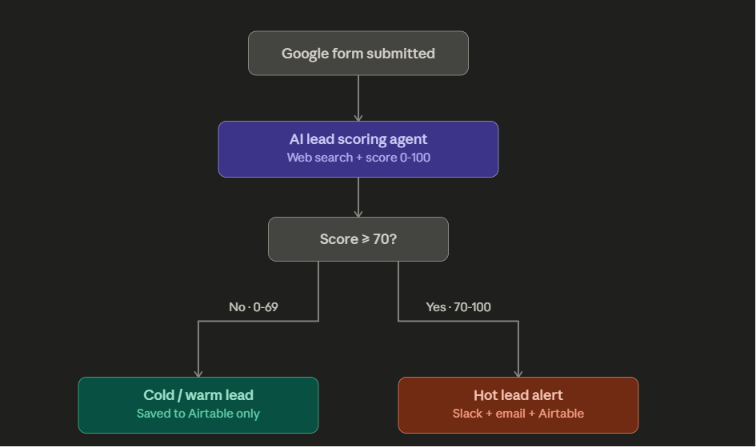

# Lead Qualification Agent
*A self-directed AI + automation project — B2B lead scoring, alerting, and CRM logging, built in n8n.*

> **Overview:** An n8n workflow that turns raw form submissions into scored sales intelligence — an AI agent researches each company live on Google (via SerpAPI), scores it 0–100 with GPT-4o-mini, then instantly alerts sales on Slack + Gmail for hot leads while logging every submission to an Airtable CRM.

## 🎯 Business Value

* **Problem Solved:** Replaces manually researching every inbound lead — checking whether the company is even real, sizing it up, deciding if it's worth a reply — and manually copying form submissions into a CRM.
* **Impact:** Every lead gets an evidence-based score in seconds instead of sitting in an inbox until someone has time to vet it; hot leads (score ≥ 70) reach sales on Slack **and** email within moments of submission; every lead — hot, warm, or cold — is logged to Airtable automatically, so nothing gets missed or re-typed by hand.

## 🏗️ How It Works



1. **Trigger:** A Webhook (`POST /new-lead`, protected with Header Auth) receives the lead payload.
2. **Score:** An AI Agent (GPT-4o-mini) researches the company live via SerpAPI, then a Structured Output Parser locks the result into `{ score, tier, reasoning }`.
3. **Route:** Hot leads (≥ 70) → Slack + Gmail alert, then logged to Airtable. Warm/cold leads → straight to Airtable, no alert noise.

## 🚀 How to Deploy (JSON Import)

1. Download `workflow_code.json` from this repository.
2. Open your n8n workspace and click `Import from File`.
3. Configure your own credentials: **SerpAPI**, **OpenRouter** (GPT-4o-mini, or swap for a premium model in production), **Airtable** Personal Access Token, **Slack API**, **Gmail OAuth2**, and **Header Auth** on the Webhook node — see `.env.example` for what it expects.
4. Update the hardcoded values to your own setup: the Slack channel (`#hot-leads`), the Gmail recipient, and the Airtable base/table (columns: `Name`, `Email`, `Company`, `Score`, `Tier`, `Reasoning`, `Submitted At`).
5. Test it with the included sample lead:
   ```bash
   curl -X POST "https://YOUR-N8N-URL/webhook/new-lead" \
     -H "Content-Type: application/json" \
     -H "X-Webhook-Secret: your-secret-here" \
     -d @test_payload.json
   ```
6. Activate the workflow, then point your real lead source (company website form, etc.) at the same URL.

> ⚠️ Timestamps default to `Asia/Kolkata` — adjust the `.setZone()` call in **Edit Fields** if you're elsewhere. `workflow_code.json` has already been sanitized of personal credentials before publishing here.
