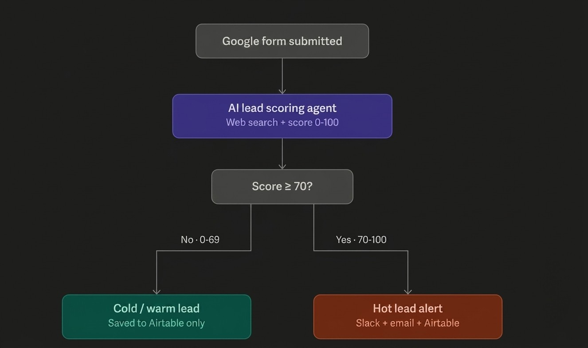
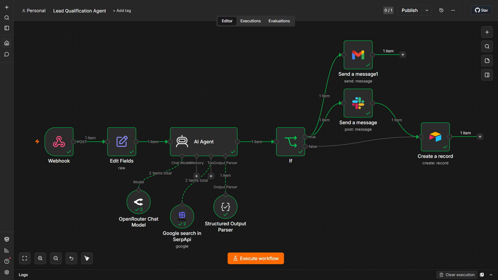
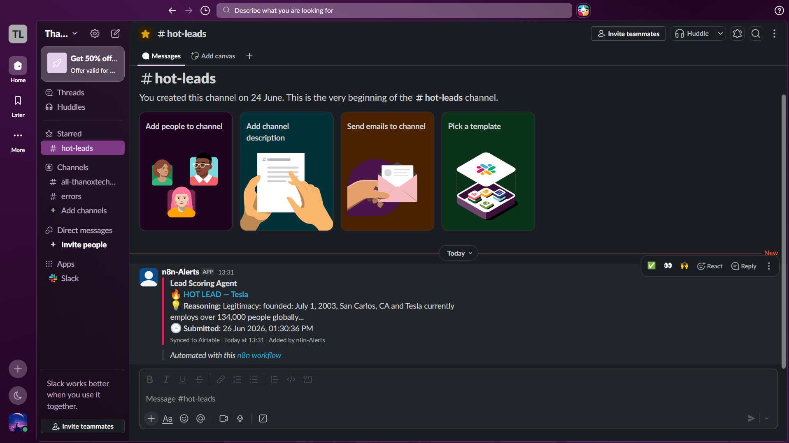
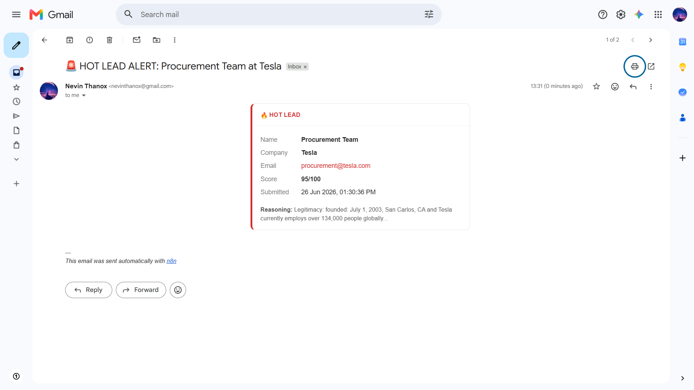
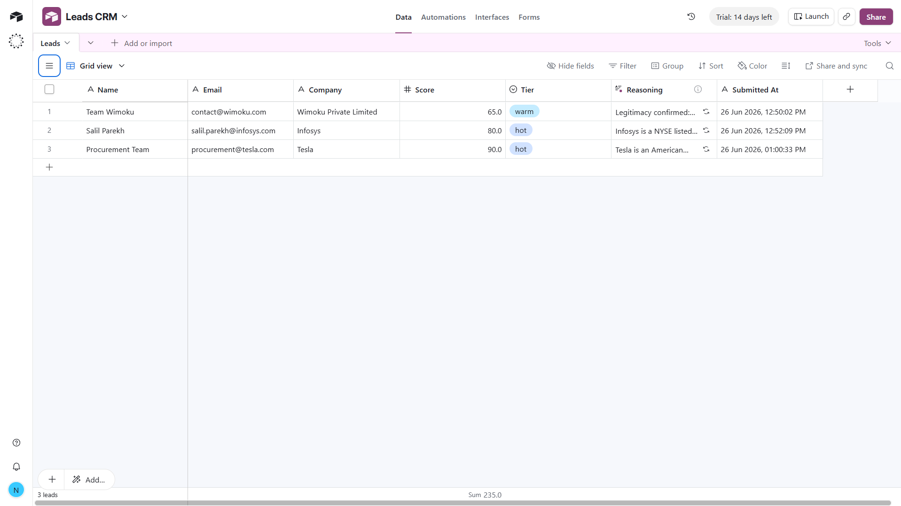

# 🎯 Lead Qualification Agent

### An AI agent that researches, scores, and routes every inbound B2B lead — before a human ever opens the inbox.

   

- ⚡ **Seconds, not hours** — every lead is researched, scored, and routed before a rep would have opened the email.
- 🔍 **Evidence-based, not guessed** — a score only counts if it's backed by a verifiable fact.
- 📬 **Redundant alerting** — hot leads hit Slack *and* Gmail in parallel, so no single missed notification costs a lead.
- 🗄️ **Zero silent drops** — every submission, hot or not, is logged automatically.

## 📂 Repository Structure

```
lead-qualification-agent/
├── README.md
├── architecture_flow.png     # Diagram used in the Architecture section below
├── workflow_code.json        # Exported n8n workflow — ready to import
├── .env.example               # Required environment variables
├── test_payload.json          # Sample lead for smoke-testing the webhook
└── screenshots/
    ├── n8n-execution.png     # Full workflow run, zero errors
    ├── slack-alert.png       # Hot lead alert in Slack
    ├── gmail-alert.png       # Hot lead alert in Gmail
    └── airtable-crm.png      # Every lead logged to the CRM
```

## Table of Contents

- [Repository Structure](#-repository-structure)
- [Overview](#-overview)
- [The Problem It Solves](#-the-problem-it-solves)
- [Architecture](#-architecture)
- [Engineering Decisions](#-engineering-decisions)
- [Tech Stack](#-tech-stack)
- [Getting Started](#-getting-started)
- [Proof It Works](#-proof-it-works)
- [Scaling to Production](#-scaling-to-production)

## 🧭 Overview

**Lead Qualification Agent** turns a raw form submission into evidence-based sales intelligence in seconds. An AI agent researches the company live on Google, scores it 0–100 against a fixed rubric, and a routing node decides what happens next: hot leads escalate to Slack and Gmail immediately, while every lead — regardless of tier — is logged to an Airtable CRM automatically. No manual research. No manual data entry. No lead sitting in an inbox waiting for five free minutes.

## 💡 The Problem It Solves

| Without this workflow | With this workflow |
|---|---|
| Every lead needs a human to check whether the company is even real | The agent verifies legitimacy against live search results before it scores anything |
| Hot leads sit in an inbox until someone has time to triage them | Hot leads reach Slack **and** Gmail within seconds of submission |
| Every qualified lead gets typed into a CRM by hand | Every lead — hot, warm, or cold — is logged to Airtable automatically |
| Scoring is a gut call that shifts depending on who picks it up | Every lead is scored against the same fixed, evidence-based rubric |

## 🏗️ Architecture



1. **Trigger** — a `Webhook` (`POST /new-lead`), protected with header authentication, receives the raw form payload.
2. **Normalize** — an `Edit Fields` node reshapes the payload into a clean record and stamps it with a timezone-correct submission time.
3. **Research & Score** — an `AI Agent` (GPT-4o-mini) runs two targeted Google searches per company through SerpAPI, then scores the lead against a fixed rubric:
   - **Buying intent** (0–40) — read from what they actually wrote
   - **Legitimacy** (0–30) — only awarded if search surfaces a verifiable fact
   - **Size / fit** (0–30) — inferred from what search returns

   A `Structured Output Parser` locks the result into a strict `{ score, tier, reasoning }` shape.
4. **Route** — an `If` node checks the tier: 🔥 **hot** (70–100) → Slack + Gmail. 🌤️ **warm** (40–69) or ❄️ **cold** (0–39) → skip the noise.
5. **Log** — every lead, regardless of tier, is written to Airtable as a permanent record.

## 🧠 Engineering Decisions

The interesting part of this project isn't that it calls an LLM — it's the guardrails built around it.

- **A website is never accepted as proof a company is real.** The agent only credits legitimacy when live search surfaces something independently verifiable — an exact employee count, a founding year, a funding figure, a news mention, a listed address. No verifiable fact, no points. This closes the most common failure mode of LLM-based scoring: confidently vouching for a lead on vibes alone.
- **One score, three auditable parts.** Every result is the sum of independently-reasoned sub-scores — buying intent, legitimacy, and size/fit — instead of one opaque number, so every score is explainable, not a black box.
- **Structured output as a contract, not a suggestion.** The agent's answer is forced through a Structured Output Parser into a strict `{score, tier, reasoning}` shape, so downstream nodes read a guaranteed field instead of parsing free text or guessing with regex.
- **The threshold lives in exactly one place.** The `If` node doesn't re-implement "what counts as hot" — it checks `tier == "hot"` and nothing else. If the bar for a hot lead ever changes, there's one place to change it.
- **Disciplined tool use, not free-roaming search.** The SerpAPI tool is scoped to one exact query per call, company-name-first, so research stays targeted and reproducible instead of wandering.
- **Redundant, actionable alerting.** Hot leads hit Slack (fast, ambient, hard to miss mid-workday) and Gmail (durable, still there if Slack was muted) in parallel — both formatted as structured, color-coded cards linking back to the CRM record, not a wall of plain text.
- **Nothing gets silently dropped.** Warm and cold leads skip the alert noise but never skip the CRM, so a lead that wasn't exciting enough to page someone about still isn't lost.
- **Stateless by choice, not by oversight.** The agent carries no memory between runs — each submission is an independent classification, which is the right amount of complexity for a one-shot scoring task and avoids leaking context between unrelated companies.
- **Failures are caught, not silent.** The workflow is wired to a dedicated n8n error workflow, so a failed execution is handled centrally instead of vanishing without a trace.
- **The details that are easy to skip, and weren't.** The public webhook sits behind header authentication instead of being left open, and every timestamp is written in an explicit, named timezone instead of drifting with wherever the server happens to be hosted.

## 🧰 Tech Stack

| Layer | Tool | Role |
|---|---|---|
| Orchestration | n8n (self-hosted, Docker) | Event-driven engine tying every step together |
| Ingestion | Webhook + Header Auth | Secure entry point for lead submissions |
| Reasoning | GPT-4o-mini via OpenRouter | Scores and explains every lead against a fixed rubric |
| Grounding | SerpAPI (Google Search) | Gives the agent live, verifiable facts instead of relying on training data |
| Output contract | LangChain Structured Output Parser | Forces a strict `{score, tier, reasoning}` JSON shape |
| Alerting | Slack API · Gmail OAuth2 | Real-time, redundant notification for hot leads |
| System of record | Airtable | Lightweight CRM log for every submission |

## ⚙️ Getting Started

1. **Import the workflow.** Download `workflow_code.json` and import it in n8n via *Import from File*.
2. **Connect your credentials.** All of the following are configured through n8n's credential manager, not environment variables:

   | Service | Credential Type | Used By |
   |---|---|---|
   | SerpAPI | API Key | Live company research |
   | OpenRouter | API Key | GPT-4o-mini scoring |
   | Airtable | Personal Access Token | CRM logging |
   | Slack | OAuth / Bot Token | Hot lead alerts |
   | Gmail | OAuth2 | Hot lead alerts |
   | Webhook | Header Auth | Securing the intake endpoint |

3. **Set the two required variables.** Copy `.env.example` to `.env` and fill in:

```bash
   N8N_WEBHOOK_URL=https://your-n8n-instance.com/webhook/new-lead
   WEBHOOK_SECRET=your-random-secret-here
```

4. **Point it at your own setup.** Update the hardcoded values: the Slack channel (`#hot-leads`), the Gmail recipient, and the Airtable base/table (columns: `Name`, `Email`, `Company`, `Score`, `Tier`, `Reasoning`, `Submitted At`).
5. **Smoke-test it** with the included sample lead:

```bash
   curl -X POST "https://YOUR-N8N-URL/webhook/new-lead" \
     -H "Content-Type: application/json" \
     -H "X-Webhook-Secret: your-secret-here" \
     -d @test_payload.json
```

6. **Activate the workflow** and point a real lead source — a website form, a landing page — at the same URL.

> **Note:** Timestamps default to `Asia/Kolkata`. If you're elsewhere, update the `.setZone()` call in the **Edit Fields** node.

## 🖼️ Proof It Works

<details>
<summary><strong>📸 Click to expand — screenshots</strong></summary>

| What it proves | Screenshot |
|---|---|
| End-to-end execution — every node fires, zero errors |  |
| Hot lead reaches the team on Slack within seconds |  |
| Hot lead reaches the team on Gmail, in parallel |  |
| Every lead — hot, warm, or cold — lands in the CRM |  |

</details>

## 🔭 Scaling to Production

The current build — local Docker n8n, plus GPT-4o-mini on OpenRouter's low-cost tier — is a deliberate **Proof of Concept**, not a shortcut. The goal was to validate the logic, the routing, and the end-to-end automation cheaply before spending on production infrastructure and premium model tokens. The path from here is already mapped out:

| Aspect | Proof of Concept (current) | Production Plan |
|---|---|---|
| Hosting | Local Docker n8n | n8n Cloud (or a managed VM) for uptime, backups, and no local dependency |
| LLM | GPT-4o-mini via OpenRouter's low-cost tier | GPT-4o or Claude Sonnet directly via OpenAI/Anthropic for stronger reasoning and higher rate limits |
| Secrets | n8n's local credential store + a `.env` webhook secret | A dedicated secrets manager with rotation |
| Cost control | A fresh two-query search on every submission | Cache repeated company lookups so re-submissions don't re-spend API budget |
| Data integrity | No deduplication — repeat submissions create repeat records | Deduplicate incoming leads by email/company before scoring |
| CRM | Airtable — fast to stand up, fine for low volume | Salesforce or HubSpot once volume outgrows a lightweight base |
| Ingress security | A static header secret | Signed requests or OAuth2 on the public webhook |

These aren't gaps that were missed — they're the known, deliberate trade-offs of a fast POC, tracked here on purpose.
