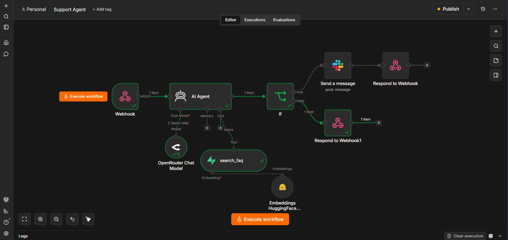
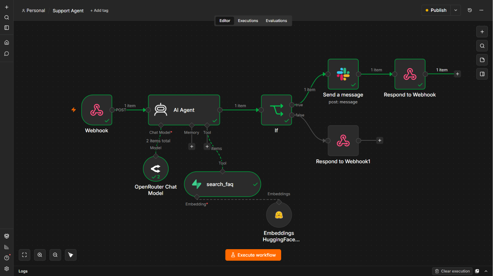
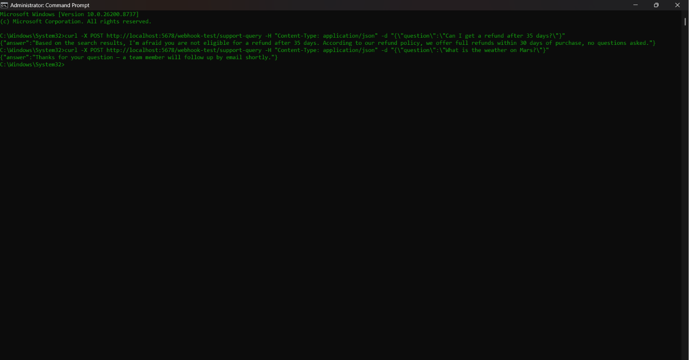
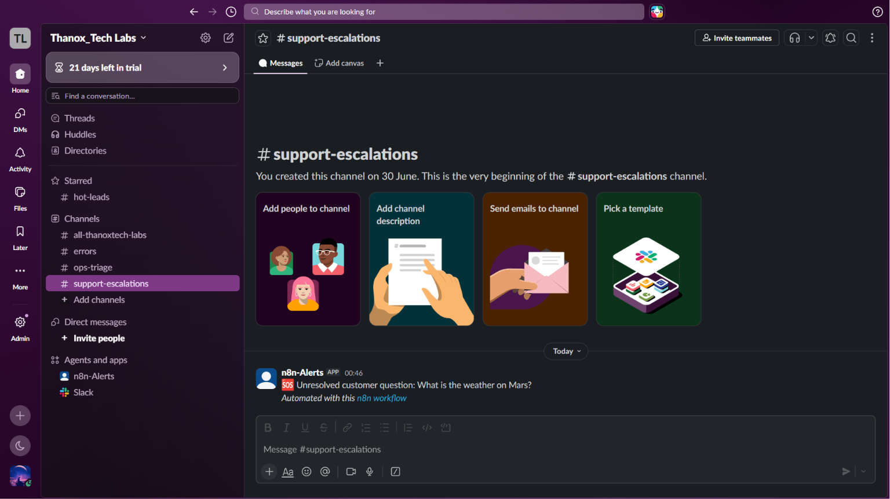

# RAG-Powered Support Agent

An n8n automation that answers customer support questions by semantically searching a company FAQ (Retrieval-Augmented Generation) instead of guessing, and automatically hands off anything it can't answer to a human via Slack.

**Stack:** n8n (self-hosted, Docker) · OpenRouter (`openai/gpt-oss-20b`) · Hugging Face Inference (`sentence-transformers/all-MiniLM-L6-v2`) · Supabase (pgvector) · Slack



## 🧠 How It Works

Two separate n8n workflows:

1. **Ingestion** *(run once, or whenever the FAQ changes)* — FAQ text is split into ~400-character chunks (40-character overlap), each chunk is turned into a 384-dimension embedding, and both are written to a Supabase (`pgvector`) table.
2. **Live agent** *(runs on every incoming question)* — a webhook receives the question; an AI Agent is instructed to always call a `search_faq` retrieval tool first and answer only from what it retrieves. If nothing relevant is found, it returns a fixed sentinel (`ESCALATE_TO_HUMAN`) instead of guessing — an `IF` node checks for that sentinel and routes to a Slack alert; otherwise the grounded answer goes straight back as the webhook response.

## ✅ Proof It Works

Tested end-to-end on the local instance — the workflow executes clean through every node, a real FAQ question returns a grounded answer, and an out-of-scope question escalates to Slack instead of getting an invented one:





## 🎯 Business Value

- **Problem solved:** Support teams re-answer the same policy questions (refunds, billing, discounts) every day, and a generic AI chatbot becomes a liability the moment it invents a policy that doesn't exist.
- **Impact:**
  - Every answer is grounded in real FAQ content — the agent is instructed to answer only from what it retrieves, never from its own assumptions.
  - Anything outside the FAQ's coverage escalates to a human in Slack automatically, so no wrong answer reaches a customer.
  - Zero-cost to prototype — no OpenAI key needed; the LLM and embeddings both run on free-tier providers.

## 🔧 Prototype Scope & Production Notes

Built as an architecture demo to prove the full RAG pattern end-to-end — not shipped as a finished product. A few deliberate choices, and what would change for a real deployment:

- **Hosting:** runs on a local, self-hosted n8n instance (Docker), not n8n Cloud. This proves the workflow logic without needing paid hosting; a company rollout would move to n8n Cloud or a managed instance with uptime monitoring, backups, and centralized secrets management.
- **Models:** uses free-tier/open-weight models (OpenRouter `gpt-oss-20b` for the agent, Hugging Face Inference `all-MiniLM-L6-v2` for embeddings) to keep the prototype at zero cost. They're enough to prove the retrieval-and-grounding logic works on test traffic, but are rate-limited on the free tier — a production build would use models sized to the company's real latency, scale, and data-governance requirements.
- **Why build it this way:** the point of this project is the architecture and the reasoning behind it — chunking strategy, retrieval-before-answer enforcement, hallucination guardrails, human-in-the-loop escalation, workflow-level error handling — not the specific model or hosting choice. Those decisions carry over regardless of what sits underneath.

## 🚀 How to Deploy (JSON Import)

1. **Set up Supabase** (free tier works): create a project, open the SQL editor, and run:
   ```sql
   create extension if not exists vector;

   create table documents (
     id bigserial primary key,
     content text,
     metadata jsonb,
     embedding vector(384)  -- 384 = all-MiniLM-L6-v2's output size
   );

   create or replace function match_documents (
     query_embedding vector(384),
     match_count int default null,
     filter jsonb default '{}'
   ) returns table (id bigint, content text, metadata jsonb, similarity float)
   language plpgsql as $$
   #variable_conflict use_column
   begin
     return query
     select id, content, metadata, 1 - (documents.embedding <=> query_embedding) as similarity
     from documents
     where metadata @> filter
     order by documents.embedding <=> query_embedding
     limit match_count;
   end;
   $$;
   ```
2. Copy `.env.example` to `.env` and fill in your real keys — never commit the real `.env`.
3. In n8n: **Workflows → Import from File** for both `workflow_ingestion.json` and `workflow_agent.json`.
4. Add credentials for Supabase, Hugging Face, OpenRouter, and Slack, then run `workflow_ingestion` once to populate Supabase with your FAQ.
5. Activate `workflow_agent`, then test it:
   ```bash
   curl -X POST https://YOUR-N8N-URL/webhook/support-query \
     -H "Content-Type: application/json" \
     -d @test_payload.json
   ```
