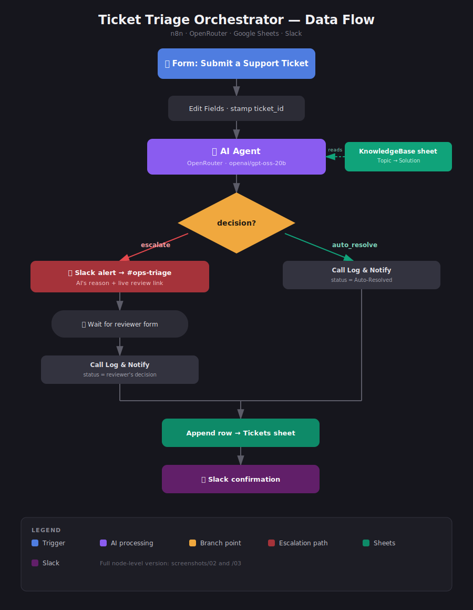
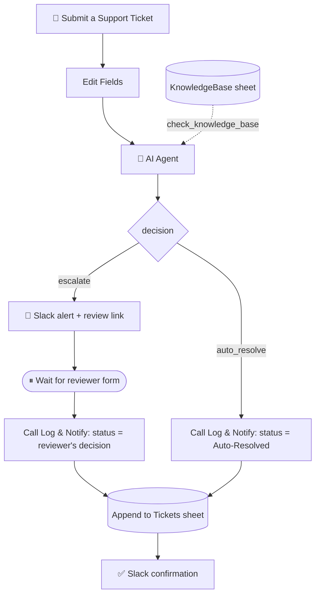

# 🎫 Ticket Triage Orchestrator

**Overview:** An n8n workflow that triages incoming support tickets with an AI agent grounded in a Google Sheets knowledge base — auto-resolving documented issues and escalating everything else to a human reviewer over Slack, with every outcome logged automatically. Connects an n8n Form → OpenRouter (LLM) → Google Sheets → Slack.

## 👋 About This Project

I built this end-to-end as a self-directed project for my internship applications — it's meant to show how I think through an automation problem, not to be a production deployment. The part I actually wanted to demonstrate is an AI agent making a real decision (auto-resolve vs. escalate) against a live knowledge base, with a human-in-the-loop safety net and a full audit trail, rather than a toy demo that just calls an API and prints a response.

A few things are deliberately at "demo" settings, and I'd rather be upfront about the line between placeholder and structural design than have it look accidental:

| | This build | Production |
|---|---|---|
| **Hosting** | Local n8n via Docker, on my own machine | n8n Cloud or a managed/self-hosted instance — uptime, backups, team access |
| **LLM** | Free-tier model via OpenRouter (`openai/gpt-oss-20b:free`) — good for iterating, but rate-limited | A paid model chosen for the accuracy/latency/cost the use case needs, likely under the company's own data-handling agreement |
| **Knowledge base** | 3 rows I wrote myself to exercise both branches | Owned and maintained by whoever runs the process |
| **Demo video** | Couldn't record a clean one — repeated test runs burned through the free OpenRouter allowance before I got a good take, not a bug in the workflow itself. Screenshots stand in as proof instead (see below). | — |

## 🎓 Skills Demonstrated

- **AI agent design & prompt engineering** — the system prompt gives the agent narrow, explicit escalation criteria (money/legal/security vs. routine fixes) instead of a vague "use your judgement," and grounds every decision in a live knowledge-base lookup rather than hardcoded rules.
- **Workflow orchestration** — branching logic, a reusable sub-workflow (`Log & Notify`) called from two different paths, and a human-in-the-loop pattern built on n8n's `Wait` node + resume-by-form.
- **Third-party API integration** — Slack (bot messaging), Google Sheets (OAuth2, used as both a read-as-tool source and a write target), and an LLM gateway (OpenRouter) chosen specifically so the model is swappable without touching workflow logic.
- **Reliability thinking** — a shared error workflow across both workflows, execution-state persistence for a pause that might last hours, input sanitization against formula injection before anything reaches Google Sheets, and graceful continue-on-error on the AI call.
- **Structured data validation** — enforcing a strict JSON schema on the LLM's output via a Structured Output Parser instead of trusting free-text parsing.
- **Documentation** — this README, a sample test payload, and clear deploy steps, written so someone other than me could pick it up.

## 🎯 Business Value

- **Problem Solved:** Someone had to read every incoming ticket by hand, decide whether it was a routine, documented issue or something needing a second pair of eyes (money, legal, security), respond, and log it for tracking.
- **Impact:** Routine issues with a documented fix — password resets, account lockouts — resolve in seconds with no human touch. Anything involving money, legal exposure, or suspicious account activity is routed straight to a reviewer with the AI's reasoning already attached, instead of sitting in a shared inbox. Every decision, automated or human, lands in one sheet and one Slack channel with zero manual logging.

## 🏗️ Architecture & Data Flow





1. **Trigger:** `On form submission` — a public n8n form ("Submit a Support Ticket") collects Subject, Description, and Category (IT / HR / Finance).
2. **Processing:** `Edit Fields` stamps a `ticket_id` and normalizes the payload. `AI Agent` (OpenRouter, `openai/gpt-oss-20b`) calls `check_knowledge_base` to search the **KnowledgeBase** sheet, then returns a structured `decision` (`auto_resolve` / `escalate`), `reason`, and a draft `suggested_reply`, enforced by a Structured Output Parser. `If` branches on `decision`:
   - **`escalate`** → post a Slack alert with the AI's reasoning and a live review-form link, then pause on a `Wait` node until a human submits Approve/Reject, their name, and a comment.
   - **`auto_resolve`** → skip straight to logging with `status` hardcoded to `Auto-Resolved` and `reviewer` set to `AI Agent`.
3. **Output:** Both paths call the **Log & Notify** sub-workflow, which appends a row to the **Tickets** sheet and posts a confirmation to `#ops-triage` in Slack.

## 🧠 How the AI Decides

The agent's instructions keep escalation narrow and specific — it only escalates when:
- the topic involves money, refunds, or legal issues,
- the ticket reports suspicious or unauthorized account activity, or
- `check_knowledge_base` returns no matching row at all.

Everything else with a documented, safe fix auto-resolves — including tickets that *sound* urgent (locked accounts, failed logins) as long as the matched KB row describes a routine self-service or admin-panel fix rather than a security incident. That distinction lives entirely in the prompt and the sheet, not in workflow logic, so retuning what escalates is a copy edit, not a redeploy.

## 📸 Proof of Execution

No demo video (see [About This Project](#-about-this-project)) — here's the workflow actually running, screenshot by screenshot, in order:

| # | Screenshot | Shows |
|---|---|---|
| 1 | `screenshots/01-form-submit-ticket.png` | The public intake form a user fills out |
| 2 | `screenshots/02-canvas-escalate-path.png` | Full canvas after a run that took the escalate branch |
| 3 | `screenshots/03-canvas-auto-resolve-path.png` | Full canvas after a run that took the auto-resolve branch |
| 4 | `screenshots/04-form-review-decision.png` | The human review form a reviewer sees on the review link |
| 5 | `screenshots/05-form-submitted-confirmation.png` | Confirmation screen after a form submission |
| 6 | `screenshots/06-sheet-knowledge-base.png` | The KnowledgeBase tab the agent reads from |
| 7 | `screenshots/07-sheet-tickets-log.png` | The Tickets tab after both example runs logged |
| 8 | `screenshots/08-slack-ops-triage-channel.png` | Both notifications in `#ops-triage` (review link redacted — see note) |
| 9 | `screenshots/09-canvas-log-and-notify-subworkflow.png` | The `Log & Notify` sub-workflow in isolation |

> Screenshot 8 has the review-link line blacked out. The original contains a live, execution-specific token from n8n's `resumeFormUrl` — not something that belongs in a public repo, even from a local instance. I redacted it by cropping the line out programmatically; give it a quick look yourself before publishing.

## 🛡️ Error Handling & Reliability

- Both workflows point to the same n8n **Error Workflow**, so a node failure in either one is caught centrally instead of failing silently.
- The orchestrator runs with `saveExecutionProgress` enabled — required for the paused execution to resume correctly once a reviewer submits the form, sometimes hours later.
- `Log & Notify`'s caller policy is restricted to `workflowsFromSameOwner`, so it can't be invoked from outside this n8n instance.
- Subject and Category are sanitized before they reach Google Sheets (leading `=`, `+`, `-`, `@` are stripped) to block formula-injection from ticket text.
- The `AI Agent` node continues on error rather than halting the whole execution if the model call fails.

## 🚀 How to Deploy (JSON Import)

1. Download `Ticket_Triage_Orchestrator.json` and `Log_and_Notify.json` from this repository.
2. In n8n, **import `Log_and_Notify.json` first** — it's the sub-workflow the orchestrator depends on — then import `Ticket_Triage_Orchestrator.json`.
3. ⚠️ **Re-point the sub-workflow calls.** n8n assigns your imported Log & Notify a new workflow ID, so open both `Call 'Log & Notify'` nodes in the orchestrator and reselect the workflow from the dropdown — the saved reference won't resolve on your instance otherwise.
4. Configure three credentials: **OpenRouter** (AI Agent), **Google Sheets OAuth2** (used for both the KB read and the ticket-log write — needs a `Tickets` tab and a `KnowledgeBase` tab in the same spreadsheet), and **Slack** (both `Send a message` nodes — set your channel, e.g. `#ops-triage`). See `.env.example` for the full checklist.
5. Seed the `KnowledgeBase` tab with your own `Topic` / `Solution` rows, or paste in `test_payload.json` to try both branches.
6. Activate both workflows, then test via the form on `On form submission`.

## 📁 Repository Structure

```
.
├── README.md
├── Ticket_Triage_Orchestrator.json   # main workflow
├── Log_and_Notify.json               # shared logging/notification sub-workflow
├── architecture_flow.svg             # diagram used above (SVG renders natively on GitHub, no image conversion needed)
├── test_payload.json                 # sample tickets — one per branch
├── .env.example                      # credentials checklist (see note inside — n8n doesn't use a real .env)
└── screenshots/                      # 9 numbered screenshots, listed under Proof of Execution above
```

## 🔍 Example in Action

| Ticket | Category | Path | Outcome |
|---|---|---|---|
| `TKT-5490` — *"Invoice discrepancy for order #7734"* | Finance | Escalated | Matched the KB's finance row → routed for manual review → approved with refund confirmed |
| `TKT-0881` — *"Login not working after multiple attempts"* | IT | Auto-resolved | Matched the KB's lockout entry, closed with no human involved |

## 📝 Worth Knowing

- Ticket IDs are the submission timestamp in milliseconds; Slack only shows the last 4 digits for readability. Look up the full ID in the sheet, not the Slack message, if you ever need to search for one precisely.
- The agent already drafts a `suggested_reply` for the submitter — it isn't wired to anything yet, but it's a ready-made hook for an auto-reply-to-requester step later.
